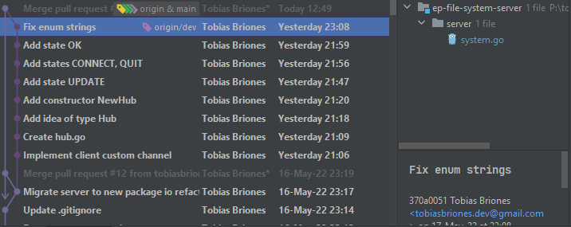

<!-- Copyright (c) 2022 Tobias Briones. All rights reserved. -->
<!-- SPDX-License-Identifier: BSD-3-Clause -->
<!-- This file is part of https://github.com/tobiasbriones/ep-tcp-file-system -->

# Enums in Go

Go is a simple language, so it's often under-engineered. I think about Go as if
Python was a real language, or Python well done.

The states of the FSM need to be well-defined constants, sum types like `enum`s.

## Iota a Bad Trick

`iota` is something too implicit, you just define groups of `const` and they get
their int value from there on starting from zero.

If you change the order of definition then your enum value is going to change,
and that is a huge problem for backwards compatibility.

```go
type State uint

const (
    Start State = iota
    Data
    Stream
    Eof
    Error
    Done
)
```

You may say, `iota` is not a trick but a feature. I don't think is a proper
feature. Can you see how fragmented this is going?

Tutorials on the internet tell you to use `iota`, so it looks like it's
idiomatic Go.

## Lack of Features

It's like other lame languages like JavaScript or Python, you can't even define
a simple `enum` data type.

I know Go is a simple language for concurrent applications and microservices.
Easy to adopt and move forward on large teams where programmers are coming and
going (Google). But for doing mediocre things I rather use Java. You can't build
monoliths on Go by the way, so Go is just a niche language, it is not
general-purpose either.

On the other hand, I'd rather write Go than any horrible languages like Python,
PHP, or JavaScript, having into account the bloated communities and tools they
have. If you don't write static types, then you need a lot of bloated buggy
software like Anaconda, Electron, etc. It's a tradeoff, why use those languages
then?

### Fun Fact

Primitive Android programmers told you not to use `enum`s in Java because of the
overhead. That's because Android phones were super slow and limited back in that
time.

We don't have to use primitive data types, or non-cohesive algorithms as I
mentioned before. Low-level tricks is for bad programmers, that's part of the
past.

That was important at that time, but now is just a sad joke.

We have to evaluate tradeoffs pretty well.

## More than Simple Enums

For this statically typed system I need to send the states via a TCP `Message`.

Enums can be easily defined via integers (`iota`) in Go, but they don't have a
string representation. That implies that if I change the order of definition
then the whole system will immediately break and is also a trouble for backwards
compatibility.

If I use strings to define the `enum`s I lose the advantage of switching on
integer IDs. So I had to define a parallel string array to convert the value
into string.

This is too bad:



The enums are now fragmented, e.g. you have to manually keep the string
representation in sync with the bunch of `const`s defined above. That's pretty
lame.

Whenever I face these kinds of problems in Go, I have to ask: How to solve this
in a simple way?. Since that is the way Go is supposed to be.

But simple is not under-engineered though.

Messages have to be read into the application memory as programming language
constructs or abstractions, but when sending them over the network they're only
raw bytes. I heard the new Web 3 standard will fix that and that we'll send
objects instead of JSON or bytes over the network. I don't know about that
information, but I hope so!.

Transforming DTOs, raw data types, all this is too exhausting, and only shows
lack of modern tech. It also adds incorrectness in the way.

What should be sent over the network?. Integers or strings to represent
the `enum` values?. Integers use to be physical implementations. I can't add
another `enum` because I can't tell whether a `0` is a state from `FSM1`
or `FSM2` if that value comes as raw from the network. What was the client's
original intention?.

I initially used strings for the enum values, but then I have to send strings.
Then I have to read an action as a string from the client `Message`, and to
convert that raw string I need a `switch` to check it's a valid state, or else
the not-so-clever string array to use integer indices but get index out of bound
panics anytime I update the enum and spend 40 minutes debugging nonsense.

I really want to avoid that fragmentation and `switch`es.

With integer indices I can easily check if the value is valid too.

## What About Under-Engineering?

Go like many popular languages are for under-engineering, for ordinary software
written by ordinary programmers.

I can build under-engineered systems of course, but the problem is that next
move you realize you have to debug nonsense that can be easily avoided.

Robert C. Martin says, and I repeat all the time so others understand my pain: "
The only way to go fast is to go well". Those phrases are the only boilerplate I
love repeating. Java boilerplate is useless but these sentences are gold for me
to defend my position as a professional engineer against annoying "stakeholders"
or managers. They can't just fire us by writing working and tested software.

I got a better phrase for this, it looks stupid, but you have to tell this to
people because people only understands obvious things by recalling them all the
time: "the only way to do things right is to do them right", there is no
shortcut.

What can I do with a mountain of unmaintainable software that gets more
complicated and coupled each time? From my experience, I have to write
refactorable code to avoid under-engineering and over-engineering. Refactorize
later as needed. That's it.

It would be great to use Rust but companies without footprint and massive
scalability issues will prefer to use a simpler language like Go with GC.

Debugging is a skill for bad programmers. It's like comments, the more you
debug, the more issues there are in the underlying code. In years of writing
software, the only debugging skill I have is to create breakpoints
with `println` to trace program states, and saving logs for production troubles.
We don't need messy debugging tools, that's not to be proud about. Rust gives
you the information right after compiling, and we can use Rust with easier
scripting languages like TS (e.g. Deno is written in Rust, but the consumer
language is TS), see my point?.

I just can't build under-engineered systems because of my professionalism, but
can't have much overthinking when using most languages like Go, TS, etc. Thus,
the answer to this section is to find a good balance. SWE is all about solving
dynamic problems, is all about tradeoffs like how much to design in this part of
the system?.

## Final Design

I have found the following design as best for Go enums:

```go
type State string

const (
    Start  State = "START"
    Data   State = "DATA"
    Stream State = "STREAM"
    Eof    State = "EOF"
    Error  State = "ERROR"
    Done   State = "DONE"
)

var stateStrings = map[string]struct{}{
    "start":  valid,
    "data":   valid,
    "stream": valid,
    "eof":    valid,
    "error":  valid,
    "done":   valid,
}

func ToState(value string) (State, error) {
    if _, isValid := stateStrings[value]; !isValid {
        return "", errors.New("invalid state value: " + value)
    }
    return State(value), nil
}
```

Moreover, defining an empty struct which takes 0 bytes of memory and is useful
for the boilerplate of Go Sets. Go doesn't have Sets, they're just Maps with
true everywhere. Use the empty `struct` instead of bool.

```go
var valid = struct{}{}
```

That approach should be used for quit channel signals too for the reasons stated
above.
