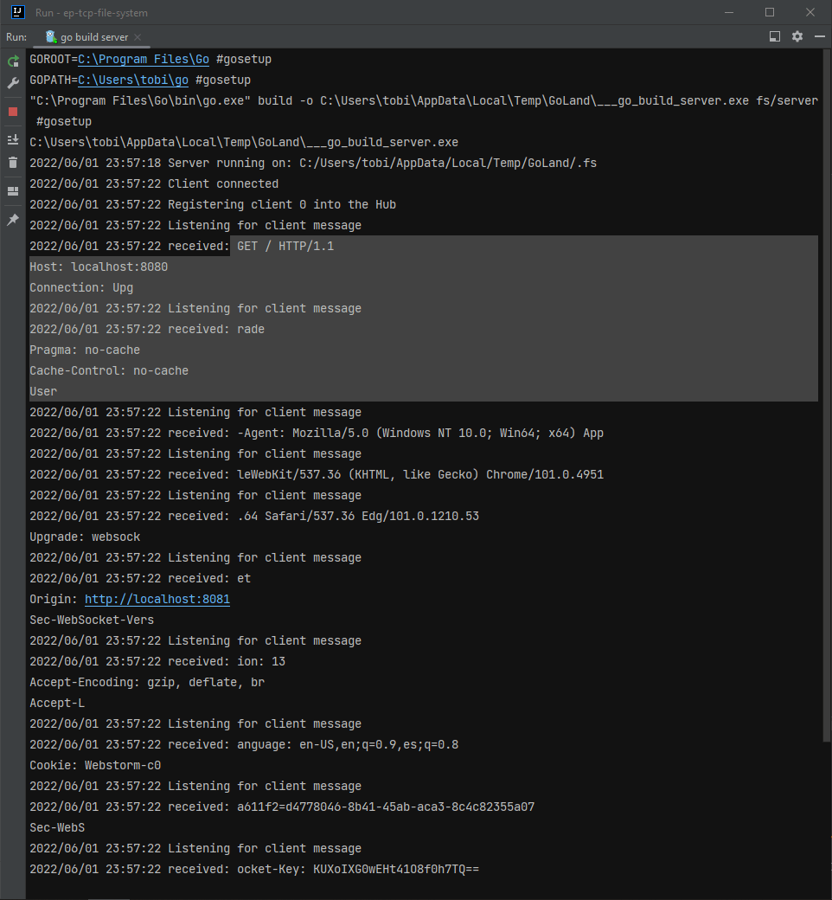
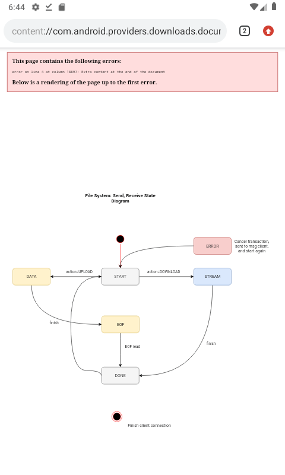

<!-- Copyright (c) 2022 Tobias Briones. All rights reserved. -->
<!-- SPDX-License-Identifier: BSD-3-Clause -->
<!-- This file is part of https://github.com/tobiasbriones/ep-tcp-file-system -->

# Plain TCP vs WebSockets

Here comes an issue I recently got: TCP are lower-level connections that
send streams as is and have a blocking API whilst Web Sockets are
implementations over TCP with asynchronous API.

I care about validating the FSM state in the server and in the client, so I
viewed the blocking TCP reads and writes as a good option with the
traditional TCP (Java, Go) sockets.

In reality, at the beginning of this project I said that I was going to use
Gorilla Web Sockets (a popular Go library) since I used that one the last
time for the dungeon game. When in doubt, I ended up using plain TCP, but I
still had the question on mind.

Now I can see more details about the project requirements, I need to do two
things: accept a centralized hub of connected users, and fulfilling the
`process` I defined though the FSM for actions like `UPLOAD`, and `DOWNLOAD`.

Engineering principles tell me I have to do one thing right, and I ended up
with two responsibilities in the end.

This problem could've been addressed in a dummy implementation: read the
file (the monolith) and send it to the connection directly. Since a have a
lot of experience, that sound really dumb for me personally, I don't earn
anything if I make such implementation, so this example project would not
make sense.

I know that files are streamed over the internet, back in the 2000s your
download failed at 99% of progress because they were cavemen. Files are just
bytes like anything in computers, and I'm an engineer, so if I can imagine
it then I can do it, why not?

I also recalled that we can model literally everything as numbers: you can
imagine it, then write the code, and inside a computer everything are just
bytes or numbers. Everything boils down to numbers or math!

Now going back from the philosophical matrix to the "real world", I have to
separate those two responsibilities, and take a TCP approach: plain TCP or
Web Sockets.

## Web Sockets

When building the admin app in Vue.js I learned something I was talking
about: the client can't implement TCP sockets as that is a vulnerability
issue (they're too low-level for the browser) so they barely have web
sockets (incompatible with my impl).

And web sockets send horrible HTTP headers I had to debug:

Thus, my server didn't understand the messages.

A solution for this is either to change my implementation to Gorilla Web
Sockets or to add some proxy to the connection or some Node.js backend as a
proxy between the web client and the Go TCP server.

Using web clients is fundamental as they're the default clients because
everything that runs in a browser is accessible to virtually anyone. So why
use plain TCP sockets?

## Communication is Key

I defined an FSM on steroids or a state system to define the contracts for
the remote computers. I can't imagine sending files over the network and
getting the wrong data!, well, I can, and here we have it in the next capture:

In the above case, I had overflow when downloading because formal
communication between the server and client was not established because of
lack of development time!. That's why upload worked but download had that
\*little\* issue.

### More Side Effects

As you can see in the image, I was able to open SVG, and PDF files, but not
PNG files. Some file formats allow to read overflowed files. That's why I
checked for underflow and overflow in the FSM process since the beginning.

The more you test these pain points, the less nonsense issues you will have
later. Or in Uncle Bob words "the only way to go fast is to go well", let
your teams memorize those words, I really mean it.

This is not the first time I apply this obviously, but I have the chance to
illustrate it here, so now you now.
