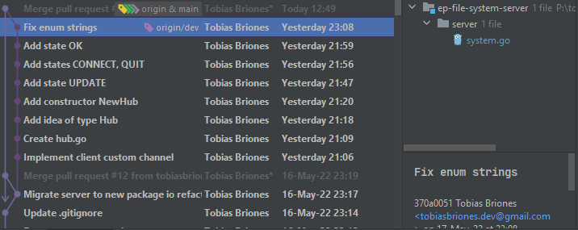

# Development

In this article, I will document the personal experience I had with Go and this
project by also employing my previous thoughts and experiences on some design
decisions.

## EOF Issues

EOF signals might be an issue in a Go implementation. They might be read as
errors, or skipped, so take special care with this signal. It's defined
at `io.EOF`.

When passing to state EOF the client sent the EOF signal I had defined in the
beginning, that is, an empty chunk: `[]byte{}`. The problem is that the server
never heard back from the client and the communication was on hold forever. The
server didn't read that EOF signal, so it wasn't able to proceed with the next
state.

This had me some time reasoning about some synchronization issue, but the
problem is that the signal was not getting read by the server because it is an
empty message literally. Go writes and reads keep in sync due to its good
concurrency model to write linear code, so synchronization was not the problem.
It might have been due to some validation logic I wrote or the way the empty
message is handled.

I wanted to use the empty chunk as my EOF signal to keep reading chunks. This is
because data is sent as chunks instead of actual high-level `Message`s. So I
thought it was ok to keep with that inertia and get the EOF signal just as the
empty chunk.

In the end, I realized that was a primitive design. I chose to use raw chunks to
remove the overhead when streaming files. The EOF is only sent once, so I must
use a proper high-level `Message`.

After implementing the design said above, all my headaches were immediately
terminated.

There's no need to implement archaic primitive-obsession systems nowadays. You
need fewer algorithms or tricks to handle that data. Replace stupid algorithms
with well-defined domain specific centric systems.

Sending the chunks as raw byte arrays is good because a file is just that, a
bunch of bytes without any structure. So there's no problem with that design
decision. It also avoids the extra overhead of sending a `Message` as long as
the FSM states are valid in the client and server, that is, state `DATA` (
upload) or `STREAM` (download).

### Example/Take Away

In my
another [file system](https://github.com/tobiasbriones/cp-unah-mm545-distributed-text-file-system)
written in Java I had to standardize the path separator because I don't work for
M$ Windows or Linux or macOS.

I had my own file system, so I don't care if M$ marketers decide to use a cringe
symbol that has to be escaped all the time for Windows paths just to brand it as
Microsoft Windows only.

I do direct math, computer science, etc. So my domain is math, computer science,
etc. My domain is about doing the right thing right, so most of the time I
choose to build the DSL instead of relying on
generic/primitive/platform-dependent standards.

Now when coming to performance everything turns obscure and hell (imagine
those "algorithms" written in C/C++ for high-performance models). That's because
computer hardware is general-purpose (that is good), and imperative. If you want
a performant high-level "algorithm" well done, your computer hardware will tell
you: we don't do that here.

Fortunately, performance is not the most important tradeoff, and computer
hardware has evolved lately to implement better architectures like ARM, or SIMD.
That way hardware gets more familiarized with linear algebra and math, and it's
more efficient.

## Domain Model

I had some loose file system logic, some weird data structures, and the utility
functions. This is a design smell, so I decided to build a basic domain model
based on my
other [file system](https://github.com/tobiasbriones/cp-unah-mm545-distributed-text-file-system/tree/main/model)
.

This basic model just adjusts to the project requirements, so I don't have to
implement other features like `getParent`, or tree traversal, etc.

The Android and Web clients need to read these models too, building the base
model for the file system (`File`, `Directory`, `Node`, operations like file
name/extension, etc.) would be insanely expensive.

To address this problem, the domain model in the server has to be adequate for
this project since it's the most important module. The clients can read just
primitive data types to consume the content.

This way, the loose logic is correctly coupled, and testable.

I always test the domain modules as much as I can to avoid propagating errors
forward to presentation layers, and avoid system downtimes or failures.

## Enums in Go

Go is a simple language, so it's often under-engineered. I think about Go as if
Python was a real language, or Python well done.

The states of the FSM need to be well-defined constants, sum types like `enum`s.

### Iota a Bad Trick

`iota` is something too implicit, you just define groups of `const` and they get
their int value from there on starting from zero.

If you change the order of definition then your enum value is going to change,
and that is a huge problem for backwards compatibility.

```go
type State uint

const (
Start State = iota
Data
Stream
Eof
Error
Done
)
```

You may say, `iota` is not a trick but a feature. I don't think is a proper
feature. Can you see how fragmented this is going?

Tutorials on the internet tell you to use `iota`, so it looks like it's
idiomatic Go.

### Lack of Features

It's like other lame languages like JavaScript or Python, you can't even define
a simple `enum` data type.

I know Go is a simple language for concurrent applications and microservices.
Easy to adopt and move forward on large teams where programmers are coming and
going (Google). But for doing mediocre things I rather use Java. You can't build
monoliths on Go by the way, so Go is just a niche language, it is not
general-purpose either.

On the other hand, I'd rather write Go than any horrible languages like Python,
PHP, or JavaScript, having into account the bloated communities and tools they
have. If you don't write static types, then you need a lot of bloated buggy
software like Anaconda, Electron, etc. It's a tradeoff, why use those languages
then?

#### Fun Fact

Primitive Android programmers told you not to use `enum`s in Java because of the
overhead. That's because Android phones were super slow and limited back in that
time.

We don't have to use primitive data types, or non-cohesive algorithms as I
mentioned before. Low-level tricks is for bad programmers, that's part of the
past.

That was important at that time, but now is just a sad joke.

We have to evaluate tradeoffs pretty well.

### More than Simple Enums

For this statically typed system I need to send the states via a TCP `Message`.

Enums can be easily defined via integers (`iota`) in Go, but they don't have a
string representation. That implies that if I change the order of definition
then the whole system will immediately break and is also a trouble for backwards
compatibility.

If I use strings to define the `enum`s I lose the advantage of switching on
integer IDs. So I had to define a parallel string array to convert the value
into string.

This is too bad:



The enums are now fragmented, e.g. you have to manually keep the string
representation in sync with the bunch of `const`s defined above. That's pretty
lame.

Whenever I face these kinds of problems in Go, I have to ask: How to solve this
in a simple way?. Since that is the way Go is supposed to be.

But simple is not under-engineered though.

Messages have to be read into the application memory as programming language
constructs or abstractions, but when sending them over the network they're only
raw bytes. I heard the new Web 3 standard will fix that and that we'll send
objects instead of JSON or bytes over the network. I don't know about that
information, but I hope so!.

Transforming DTOs, raw data types, all this is too exhausting, and only shows
lack of modern tech. It also adds incorrectness in the way.

What should be sent over the network?. Integers or strings to represent
the `enum` values?. Integers use to be physical implementations. I can't add
another `enum` because I can't tell whether a `0` is a state from `FSM1`
or `FSM2` if that value comes as raw from the network. What was the client's
original intention?.

I initially used strings for the enum values, but then I have to send strings.
Then I have to read an action as a string from the client `Message`, and to
convert that raw string I need a `switch` to check it's a valid state, or else
the not-so-clever string array to use integer indices but get index out of bound
panics anytime I update the enum and spend 40 minutes debugging nonsense.

I really want to avoid that fragmentation and `switch`es.

With integer indices I can easily check if the value is valid too.

### What About Under-Engineering?

Go like many popular languages are for under-engineering, for ordinary software
written by ordinary programmers.

I can build under-engineered systems of course, but the problem is that next
move you realize you have to debug nonsense that can be easily avoided.

Robert C. Martin says, and I repeat all the time so others understand my pain: "
The only way to go fast is to go well". Those phrases are the only boilerplate I
love repeating. Java boilerplate is useless but these sentences are gold for me
to defend my position as a professional engineer against annoying "stakeholders"
or managers. They can't just fire us by writing working and tested software.

I got a better phrase for this, it looks stupid, but you have to tell this to
people because people only understands obvious things by recalling them all the
time: "the only way to do things right is to do them right", there is no
shortcut.

What can I do with a mountain of unmaintainable software that gets more
complicated and coupled each time? From my experience, I have to write
refactorable code to avoid under-engineering and over-engineering. Refactorize
later as needed. That's it.

It would be great to use Rust but companies without footprint and massive
scalability issues will prefer to use a simpler language like Go with GC.

Debugging is a skill for bad programmers. It's like comments, the more you
debug, the more issues there are in the underlying code. In years of writing
software, the only debugging skill I have is to create breakpoints
with `println` to trace program states, and saving logs for production troubles.
We don't need messy debugging tools, that's not to be proud about. Rust gives
you the information right after compiling, and we can use Rust with easier
scripting languages like TS (e.g. Deno is written in Rust, but the consumer
language is TS), see my point?.

I just can't build under-engineered systems because of my professionalism, but
can't have much overthinking when using most languages like Go, TS, etc. Thus,
the answer to this section is to find a good balance. SWE is all about solving
dynamic problems, is all about tradeoffs like how much to design in this part of
the system?.

### Final Design

I have found the following design as best for Go enums:

```go
type State string

const (
    Start  State = "START"
    Data   State = "DATA"
    Stream State = "STREAM"
    Eof    State = "EOF"
    Error  State = "ERROR"
    Done   State = "DONE"
)

var stateStrings = map[string]struct{}{
    "start":  valid,
    "data":   valid,
    "stream": valid,
    "eof":    valid,
    "error":  valid,
    "done":   valid,
}

func ToState(value string) (State, error) {
    if _, isValid := stateStrings[value]; !isValid {
        return "", errors.New("invalid state value: " + value)
    }
    return State(value), nil
}
```

Moreover, defining an empty struct which takes 0 bytes of memory and is useful
for the boilerplate of Go Sets. Go doesn't have Sets, they're just Maps with
true everywhere. Use the empty `struct` instead of bool.

```go
var valid = struct{}{}
```

That approach should be used for quit channel signals too for the reasons stated
above.

## Go Dependency System

Something I have detected is that Go dependencies are linear to avoid circular
dependencies.

This might be a mess but is a good design decision in the end.

It can be a mess because, for example, in the dungeon game, I have the server
module and the client or game module. I need to extract the game model logic,
but I couldn't. I had to do something gross to move forward:
copy-paste the game model to the game module and to the server module.

This must be because Go is aimed for microservices and each module has to be
small and most important undependable deployable.

That's why I had said that you can't build monoliths with Go.

### Where's the Domain Model Then?

Everything is relative, as I
[recently wrote](https://blog.mathsoftware.engineer/everything-is-relative).

The most important layer or module is the app domain. With this dependency
model, it must go all the way down so the "dependency arrow" goes all the way
down. The model won't be able to see implementation details and keeps pure this
way.

I hate it because the domain must be the less verbose system, and must be in the
top of the project. The problem is that Go should be used for
independently-deployable modules.

With Java, I would create different Java/Gradle modules in the root of the
project and import them as required. I can get to be circular, but it's not too
bad. That way I can build *modular* monoliths that are pretty useful in
development. Check the
[other FS](https://github.com/tobiasbriones/cp-unah-mm545-distributed-text-file-system)
source code for seeing this.

## A Development Cycle Can Be Shorter

Analysis this project as case study, I had to release an initial alpha `0.1.0`
version and then a stable `0.1.0` version for an MVP.

The development was quite agile, and I was able to constantly deliver pull
requests for docs and dev, and also making releases in short periods of time.

Can these releases be actually used in production environment according to
Agile? Some of them just can't as they're not stable.

I usually think about the iterative model where I can create a working bicycle
and add more each iteration, unlike the incremental model that builds the parts
instead of the whole.

The initial development went a bit more monolith because I decided from the
beginning to use chunks of bytes to transfer the files, otherwise the system
would be badly designed. That big feature made the initial development more
monolithic and far from a stable-deployable MVP.

If I had to create this project again I would defer that feature for later and
send the whole files at once for the initial releases.

Adding too many features at once also increases the uncertainty, cyclomatic
complexity, and early testing. That makes refactorization more painful and hard
to spot.

## Measure Cohesiveness

Cohesive modules do one thing and well done. It's about the same responsibility.
This is one of the most important engineering principles I teach.

Measure this by finding pieces of code that do not match the single
responsibility.

For example, the `Client` `struct` was getting a bit out of hands. I checked and
knew already that it had different type of implementations that are not directly
related to the module.

The key here is to check specifications. The `Client` is an object that works
directly with the `net.Conn` object, so it's a networking detail. If I have file
system, or IO inside there, then is the wrong place for that logic or
implementation.

Just look at this red flag:

```go
switch c.state {
    default:
    c.listenMessage()
    case Data:
    c.listenData()
    case Stream:
    c.listenStream()
    case Eof:
    c.listenEof()
    case Done, Error:
    log.Println("Exiting client")
    return
}
```

I had pushed the `process` domain into this object. That is basically the
definition of the FSM (something pure from the hardcore domain module), while I
must have a network implementation detail into this `Client` module instead.

Projects are never perfect, and they evolve from prototypes or initial
developments. I didn't make a mistake on writing that code that way. We just
need to write code that can be refactorized.

That answers a question I've seen on the internet: Do seniors write great code
from the beginning?

I can't over-engineer to tell that I write the best code since the beginning of
all the projects, I can't under-engineer eiter because that would turn into a
problem factory soon. A senior like me just knows what to do in each situation.

## Refactorize Before It's Too Late

I often have to take significant time to refactor the code base because I know
from experience that the more issues that are carried the more cyclomatic
complexity and expensive further developments will be.

They can't fire you if you do "useless" things like refactoring or writing
better code, an autonomous engineer knows what to do, so don't let managers or
stakeholders tell you what to do, you have communication skills and technical
ones, but managers don't have any other skill than being people friendly if at
all.

A professional developer or engineer will put system constraints clearly, don't
be shy on doing things right. Shame on them if they don't want it so, capitalist
just want to sell, and they might think this is like traditional engineering
where you have a table with formulas, so you can deliver projects "on time".
It's annoying, they kind of tell you "I'm paying you to build this website, so
you have 5 days to finish it", but in reality software engineering is about
being a *domain expert* to understand the domain problem and then being a
*developer* to build the domain solution.

### My Domain

Just check how I perfectly applied this expertise on me: I'm a software engineer
with domain on math, so that is, a math software engineer. That means I can also
be a "mediator" (like OOP programmers would say) between mathematicians and
software engineers to build mathematical software or any other related project.

Computer scientists are bad at engineering and engineers are terrible at math or
anything where you need intellectual conscious skills. If I wouldn't exist then
mathematicians would be doomed to write boring proofs in PDF files (no
indexable, useless nowadays), using proprietary crap software from the 90s, and
nonsense horrible "Alexandria math library" (they even explicitly say their "
math lib" is the hugest monolith and feel proud about it, they don't know what
they do because they're building tools but are not engineers) while engineers
are doomed to write toy scientific software with wrong tools like Python or
Microsoft Excel.

Once again I prove we don't need managers and buzzwords but autonomous engineers
instead.

### Large Refactorization

If you don't refactor constantly the code you find, the project cost will
explode really quick turning into an extremely coupled system.

Large refactorizations are pretty tiring, is something that will make you
exhausted because of the large cognitive load to keep tests working and the
older code working too.

Another tip that I can give is not to underestimate the initial system design
which will avoid making large refactorizations later.

When designing system architectures we need a domain expert (e.g. someone who
has build file systems before), if I would've thought a little more about the
modules of this application the cost of development would've been lower since I
would have scaled those packages or modules since the beginning instead of
making larger refactorizations later.

Some systems are not well known, keeping the balance between under-engineering
and over-engineering is a determinant art in software engineering.

## Android Client

Mobile development is way too volatile -phenomenon pretty similar to what
happens to web development-, and I started writing code for Android 9 years
ago approximately, in the Java good days as I shared in my
[LinkedIn Post](https://www.linkedin.com/posts/tobiasbriones_android-java-softwaredevelopment-activity-6937099372325203968-gKaS?utm_source=linkedin_share&utm_medium=member_desktop_web)
and [Tweet](https://twitter.com/tobiasbriones_/status/1532412328989315072?s=20&t=dcoVZWG2Qb7E6eOlH1ufJQ).

Everything has changed many times, but I found my project quite conservative
when I created it: Activities, Fragments, XML layouts and resources,
app manifest, Kotlin instead of Java. I didn't start a Jetpack Compose project
(is what I wanted, but I still have to learn it though) but a normal
traditional app instead, so that's the reason of such conservatism.

I've been touching Android development over the last 9-10 years, mostly back
in ~2013, but since then I haven't made bigger developments or learnings.
I'm particularly interested in Compose as is a modern declarative DSL for
building UIs, and I have first-class motivation for working with clean DSLs.

Concurrency models have also been a mess in Android, I'll never forget the
old-school  `AsyncTask` that
is [deprecated as of API 30](https://developer.android.com/reference/android/os/AsyncTask)
and also reminds me of old-fashioned Java Swing desktop apps I built. I had
to learn how to launch coroutines in Android using the `Fragment` I got in hand.

I have to say, that Android has been an inspiration for me to
design [JDesk](https://jdesk.mathsoftware.engineer)
-framework I made to make my Swing apps easier- but now those Android
inspirations and everything else (Swing, JDesk) are just nostalgia. There in
lays the reason I need to move forward with declarative DSLs. 

### Managing Files

Managing files is, as usual, launching an activity via an `Intent` to show
the system file picker, so we don't need to explicitly operate on the user
storage,
[App data and files \| Android developers](https://developer.android.com/guide/topics/data)
was enough information to achieve that.

The only permission I required for storage after all was the
`WRITE_EXTERNAL_STORAGE` one.

### Porting the FS Domain

I don't mean to design a domain to Android or Web as that would be super
expensive and unnecessary.

Domain logic is mostly at the server side while clients are thinner these
days, so they only need to consume that logic. Using general constructs of
PLs instead of the domain DSL suffices to implement clients. 

### Managing Concurrency with Coroutines

Writing, testing, and debugging concurrent applications is always challenging,
even worse with side effects like file systems and network IO.

It's not enough to employ coroutines but also structured concurrency to make
it possible to implement in Android.

Fortunately we have modern languages like Kotlin and Go that support a good
application concurrency model, so it's straightforward to write concurrent
code. On the other hand, Java on it's roadmap is barely delivering project
Loom with virtual threads
for [JDK19](https://inside.java/2022/05/16/quality-heads-up) as a preview
feature, and then structured concurrency. Modern versions of Java are not
supported by Android at all.

#### Android won't Allow Network Code on the Main Thread

This is something old I've known. If you write slow-running code that is 
going to use the network, the Android app will crash to disallow this bad 
practice unless you disable it, but that would be nonsense.

#### Launching and Tracking Coroutines

This is explained in [Improve app performance with Kotlin coroutines \| 
Android developers](https://developer.android.com/kotlin/coroutines/coroutines-adv)
, so we have two parts: launching and tracking.

We have three dispatchers to run our coroutine code with main safety: 
`Dispatchers.Main`, 
`Dispatchers.IO`, `Dispatchers.Default`. In this case, `Dispatchers.IO` is 
good. That is the context that has to be used for the coroutine.

To launch a coroutine we need to understand the underlying scope that will 
define how the coroutine will live. Scopes vary, there are `viewModelScope`, 
`lifecycleScope`, so inside a `Fragment` we can use the latter.

Code on the client side will look like this:

```kotlin
suspend fun disconnect() {
    withContext(Dispatchers.IO) {
        socket.close()
    }
}
```

And from the UI:

```kotlin
lifecycleScope.launch {
    client.disconnect()
}
```

When launching a coroutine we get a `Job` that identifies that coroutine, so
we can cancel it for instance. That is part of the job of the life cycle, so
we don't leak unnecessary jobs when the app has already closed for example.
