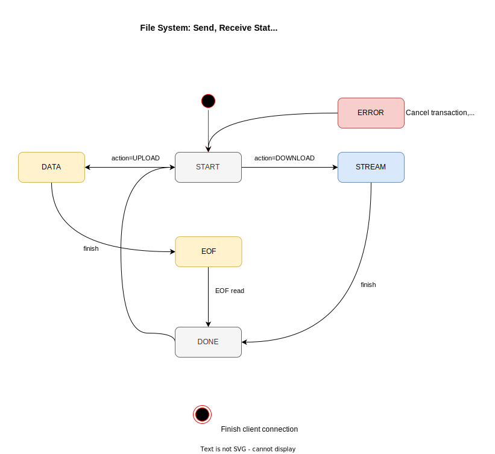

# File System TCP Protocol

A basic file transfer protocol is designed to transfer files via TCP from a Go
server to any client.

I will work with my prior experience from these two projects I developed past
year:

- [Distributed Text File System](https://github.com/tobiasbriones/cp-unah-mm545-distributed-text-file-system):
  Real time text file system written in Java 16+, Java RMI for remote object
  invocation, and JavaFX with push, pull, and local cache capabilities, deployed
  to Linux containers on Ubuntu, one container for the file server storage and
  the other for the file registry facing the external world.

- [Dungeon MST](https://github.com/tobiasbriones/dungeon-mst): A 2D dungeon
  multiplayer video game fully written in Go employing the Gorilla Web Socket
  and ebiten as game library.

## Statuses

The communication statuses are to be the following FSM:

- **START**: The server has accepted the client's request and will start to send
  data.
- **DATA**: A chunk of data that has to be buffered by the client.
- **EOF**: End of File to indicate that the file has been completely sent, and
  finish the communication.
- **ERROR**: The request couldn't be processed.

The `DATA` status should not be explicitly passed or serialized to avoid extra
boilerplate overhead as many chunks will be sent for large files.

## Serialization

To serialize the data sent over TCP, a JSON object will be employed. That way
any client can parse it.

### Structure

The DTO should look like the following:

```json
{
  "type": "START",
  "size": 1024,
  "payload": {}
}
```

The payload can contain any information needed for that state.

For the special `DATA` state, a JSON array is to be sent as payload instead.
When the client detects it as array it will know that is a data chunk. The
existence of the `size` attribute here implies that the status is `DATA` too.

The size indicates the length of the chunk or buffer that the client or server
has to read.

## System Interaction

The following UML Sequence diagram depicts the most important use cases and
logic flow for this system:


With that, stakeholders can understand the system architecture.

More conceptual or technical documentation can be developed if required, but it
is important to optimize for the source code as source of truth instead.

The file system actions for `UPLOAD` and `DOWNLOAD` are a formal finite state
machine defined above.



Invisible transitions are implicitly sent to the same state (e.g. if more 
data is coming, then the state keeps at `DATA` until if *finishes*).

### Client Updates

A TCP Hub is implemented to register, unregister, and broadcast changes to the
client.

## System Modules

The system requires the following modules:

- **fs**: Domain root module (Go).
- **process**: IO implementation of the FS, including the main FSM for streaming
  files (Go).
- **server**: TCP server implementation (Go).
- **client**: Android client app (Kotlin).
- **admin**: Basic admin dashboard (Vue.js).

The `fs` module is the file system model so that the application can understand
business logic, while the `process` module provides the physical implementation
for the FSM for actions like `DOWNLOAD` or `UPLOAD` files acting as a bridge
amount the `fs` module and external modules like `server`,
`client` or `admin`.

The `server` module implements the hub of client connections for the network
layer of the system, and it's consumed by `client`, and `admin`.

Also take into consideration that the project layout is monorepo.
