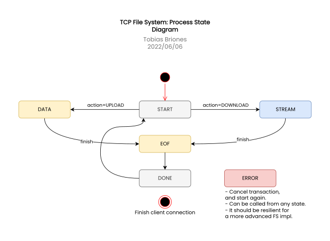

<!-- Copyright (c) 2022 Tobias Briones. All rights reserved. -->
<!-- SPDX-License-Identifier: BSD-3-Clause -->
<!-- This file is part of https://github.com/tobiasbriones/ep-tcp-file-system -->

# File System TCP Protocol

A basic file transfer protocol is designed to transfer files via TCP from a Go
server to any client.

I will work with my prior experience from these two projects I developed past
year:

- [Distributed Text File System](https://github.com/tobiasbriones/cp-unah-mm545-distributed-text-file-system):
  Real time text file system written in Java 16+, Java RMI for remote object
  invocation, and JavaFX with push, pull, and local cache capabilities, deployed
  to Linux containers on Ubuntu, one container for the file server storage and
  the other for the file registry facing the external world.

- [Dungeon MST](https://github.com/tobiasbriones/dungeon-mst): A 2D dungeon
  multiplayer video game fully written in Go employing the Gorilla Web Socket
  and ebiten as game library.

## State

The communication states are to be the following FSM:

- **START**: The communication is on hold for starting a new process.
- **DATA**: Chunks of files are being streamed from the client to the server 
  (upload).
- **STREAM**: Chunks of data are being streamed from the server to the 
  client (download).
- **EOF**: End of File to indicate that the file has been completely sent or 
  received, in order to finish the underlying process.
- **DONE**: Indicates the process has been successfully completed.
- **ERROR**: The request couldn't be processed.

The `DATA`, or `STREAM` states should not be explicitly passed or serialized to
avoid the extra boilerplate overhead as many chunks will be sent for large 
files. They are agreed before sending/receiving the chunks so both server 
and client have the correct state to handle raw chunk data.

## Serialization

To serialize the data sent over TCP, a JSON object will be employed. That way
any client can parse it.

### Structure

The DTO should look like the following:

```json
{
  "Command": {},
  "Response": 0,
  "State": "START",
  "Payload": [7, 15, 96]
}
```

Where:

- **Command**: Passes a dynamically typed hashmap or object with each 
  command signature as key-value pairs.
- **Response**: Integer constant originally defined in the server to give a 
  server response status (not that important for now).
- **State**: The process FSM state that indicates what is being done 
  (uploading, waiting for EOF, Done, etc.).
- **Payload**: Payload object defined in the server and serialized into a 
  raw byte array into this JSON attribute. It might need to use `Base64` to 
  decode the bytes on the client to read it as a JSON object. The payload data 
  types are defined on the server when in doubt.

The payload can contain any information needed for that state.

For the special `DATA` state, a JSON array is to be sent as payload instead.
When the client detects it as array it will know that is a data chunk. The
existence of the `Size` attribute here implies that the status is `DATA` too 
since the client has to send the file size when uploading it.

The size indicates the length of the chunk or buffer that the client or server
has to read.

A start payload should look like this:

```json
{
  "Action": 0,
  "FileInfo": {
    "File": {
      "Path": {
        "Value": "file.html"
      }
    },
    "Size": 5000
  },
  "Channel": "tobi"
}
```

These attributes are embedding in the Go data types, so they are actually 
flat, e.g. pass `Value` directly as the `File#Path#Value`.

## System Interaction

The following UML Sequence diagram depicts the most important use cases and
logic flow for this system:


With that, stakeholders can understand the system architecture.

Note: I have to say, this diagram is a bit out of date as if was the initial 
design I devised, and the state diagram below depicts this model more 
accurately. Even though, it still tells us how concurrent users can be seen 
by the server.

More conceptual or technical documentation can be developed if required, but it
is important to optimize for the source code as source of truth instead.

The file system actions for `UPLOAD` and `DOWNLOAD` are a formal finite state
machine defined below.



Invisible transitions are implicitly sent to the same state (e.g. if more 
data is coming, then the state keeps at `DATA` until if *finishes*).

The next flow diagram shows a normal use case for action `DOWNLOAD`:


Keeping the states consistently on the server and client by allowing a good 
communication is key.

## System Modules

The system requires the following modules:

- **fs**: Domain root module (Go).
- **process**: IO implementation of the FS, including the main FSM for streaming
  files (Go).
- **server**: TCP server implementation (Go).
- **files**: Functions implementing operations on domain files (Go).
- **utils**: Umbrella functions to help build the system (Go). 
- **client**: Android client app (Kotlin).
- **admin**: Basic admin dashboard (Vue.js).

The `fs` module is the file system model so that the application can understand
business logic, while the `process` module provides the physical implementation
for the FSM for actions like `DOWNLOAD` or `UPLOAD` files acting as a bridge
amount the `fs` module and external modules like `server`,
`client` or `admin`.

The `server` module implements the hub of client connections for the network
layer of the system, and it's consumed by `client`, and `admin`.

Also take into consideration that the project layout is monorepo.

## Client Updates

A TCP Hub is implemented to register, unregister, and broadcast changes to the
client.

## Commands

In addition to the process defined, the server also accepts commands as 
specified in the data types above.

To call a command, the process must be at state `START` (on hold), and pass 
it to the `Command` message attribute:

```json
{
  "Command": {
    "REQ": "{your-request}"
  }
}
```

along with any additional data attribute required by the command.

### Supported Commands

| **Request**     | **Attr. 1**              | **Description**                                                                |
|-----------------|--------------------------|--------------------------------------------------------------------------------|
| CREATE_CHANNEL  | CHANNEL (channel's name) | It creates a new channel. It does not perform any action if already exists.    |
| LIST_CHANNELS   | -                        | Returns a list of existing channels.                                           |
| LIST_FILES      | CHANNEL (files parent)   | Returns a list of files under the given channel.                               |
| CID             | -                        | Returns the per-server-instance ID that was generated to identify that client. |
| CONNECTED_USERS | -                        | Returns a list of all connected clients into this server hub instance.         |

## Non-Functional Requirements

There should be non-functional requirements like time out to clean the
server hub from dead clients.

Currently, there are two read timeouts: short and long. It depends on the
expectations to use one of the other, e.g. for having a client in hold it
waits long (20min), but for waiting for a chunk it waits short (20sec).

## Tests

A big amount of test cases can be found in the code base. Side effect tests
for the server are in [/server/main_test.go](../../server/main_test.go).
