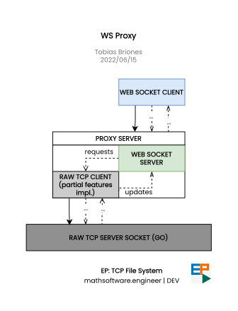

<!-- Copyright (c) 2022 Tobias Briones. All rights reserved. -->
<!-- SPDX-License-Identifier: BSD-3-Clause -->
<!-- This file is part of https://github.com/tobiasbriones/ep-tcp-file-system -->

# WS Client

In this article, the design decision for communicating a web client (Web Socket)
to the file system server (Raw TCP Socket) is established.

## Introduction

Raw TCP servers and clients are low-level implementations of sockets as said
along this project documentation. They send streams instead of
standalone packages and have a blocking nature while Web Sockets are
implemented on top of TCP but are higher-leve, this including sending
asynchronous packages of messages.

The main problem with the underlying issue is that while TCP being low-level
it needs to be implemented close to the OS layer with traditional sockets
like Java/Go/C/C++/Rust/Android TCP sockets.

Raw TCP sockets can't be added to web browsers due to security
vulnerabilities so Web Sockets are the ones that can (barely) run in the web
browser.

## Possibilities

Web clients are required for any application, at least they should be the 
default as they run on virtually any device. But does that mean that we need 
to use only Web Sockets?

One can use Web Sockets by default, but raw TCP Sockets are better for 
high-performance applications like file systems.

That is due to the extra overhead added by Web Sockets to upgrade the 
connection from HTTP to WS as well as other \*minor*\ inconveniences.

### Building a Proxy Server

This is the solution that was initially implemented.

It consists of running a Node.js Web Socket server that communicates with 
Web clients, and it's also a TCP Socket client to bridge between the actual 
TCP server in Go and the actual Web Socket client in the web browser. 

The result is the following architecture:

Architecture that works well for this project since the web socket is a 
really simple client, and we care about the file system either on the server 
or client physical devices or computers.

Web Sockets would be great for other applications like chats or mere JSON 
messages that do not require access to the device hardware.

### Migrating to Web Sockets

Migrating the file system server to Web Sockets is not feasible and does not 
give any additional advantage.

I always think about this problems in terms of what has to be done.

In this case, hardware or intensive use of disks have to be done as a 
primary use case of the system, so raw TCP Sockets make sense.

For media IO like stats and dashboards, the Web Socket Proxy works well.

Then we make use of the correct tools for the job: TCP for lower-level 
implementations, and WS for higher-level results.

It's about matching the underlying subproblems to low-level and high-level 
constructs.
